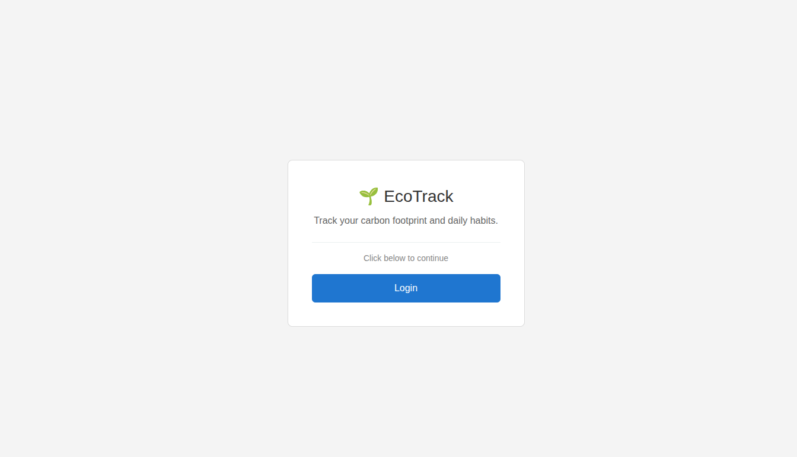
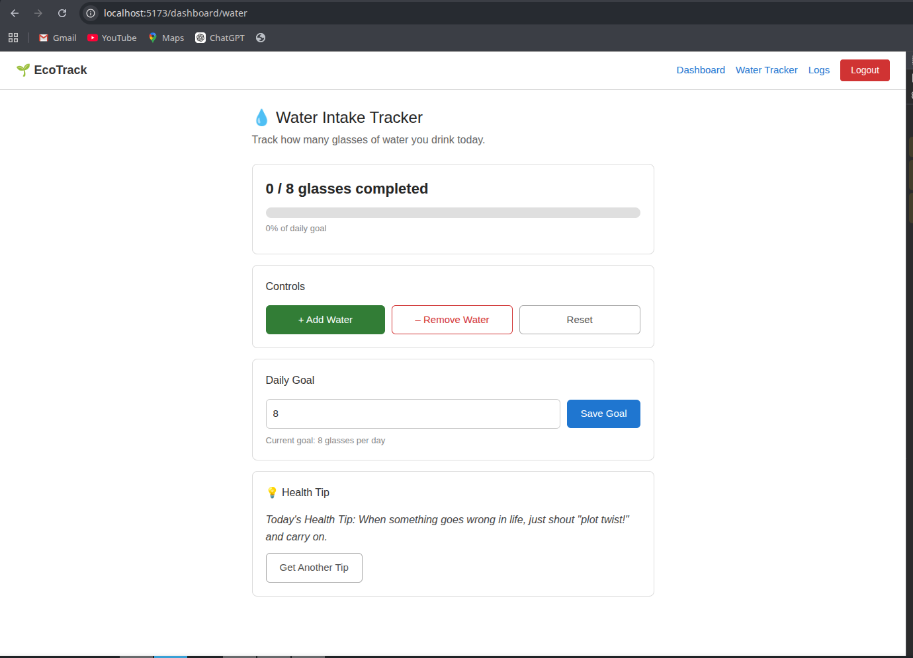
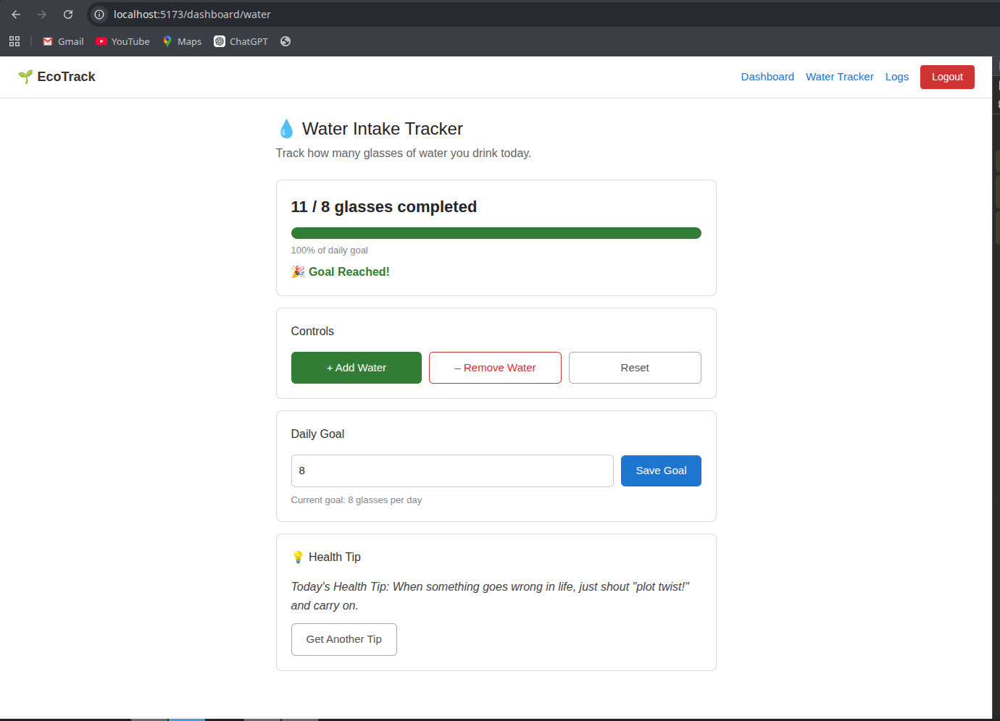

# EcoTrack — Daily Water Tracker

**Name:** Vinayak
**Roll No:** 23BCS12507
**Group:** KRG-3B

A React-based wellness feature built inside the EcoTrack dashboard. Users can log in, track daily water intake, set a goal, and fetch health tips from an external API.

---

## Features

- 🔐 Protected routes — redirects to `/login` if not authenticated
- 💧 Water intake counter with add / remove / reset
- 🎯 Saveable daily goal stored in `localStorage`
- 💡 Health tip fetched from `https://api.adviceslip.com/advice`
- ⚡ `React.memo` + `useCallback` / `useMemo` to prevent unnecessary re-renders
- 🔄 Count persists across page refreshes via `localStorage`

---

## Routes

| Route | Page |
|---|---|
| `/login` | Login page |
| `/dashboard` | Dashboard |
| `/dashboard/water` | Water Tracker |

---

## Screenshots

### Login Page


### Water Intake Tracker


### Goal Reached


---

## Getting Started

```bash
npm install
npm run dev
```

Open [http://localhost:5173](http://localhost:5173) in your browser.
